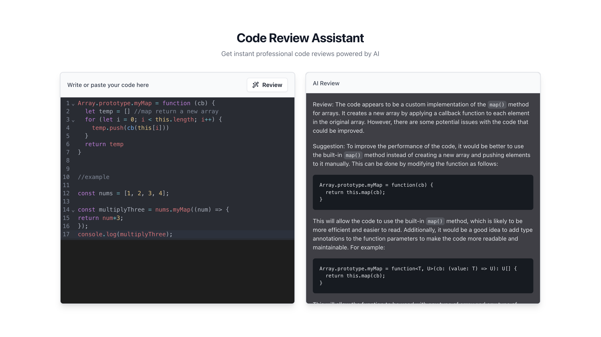

# Code Review Assistant 🚀

An AI-powered code review tool that provides instant feedback on your code. Built with React, Vite, and CodeLlama.

## Demo

- 

## Features
- 💡 Instant AI code reviews
- 🎨 Beautiful dark/light theme UI
- ✨ Real-time code editing
- 📝 Markdown-rendered feedback

## Tech Stack
- React + TypeScript + Vite
- Tailwind CSS + shadcn/ui
- CodeMirror for editing
- CodeLlama for AI analysis

## Quick Start
```bash
npm install
npm run dev
```

## Usage
1. Paste your code in the editor
2. Click "Review"
3. Get instant AI feedback

Built with ❤️ using CodeLlama and React
